# Fractals

These program written during course work of MAI-215 Named Fractal Theory.
Most of these programs are completed. Some of them contain error.
I tried using C,C++,Java,Python to build fractals image.

Note:-

While executing c and c++ program use lgraph in last during compliation.
Ex. - gcc example.cpp -lgraph

Output- 

*Cantor Set(GRCANTOR.C)

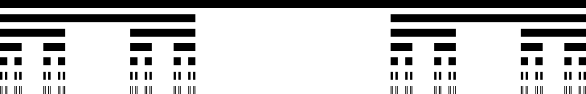

*Cantor Cubes

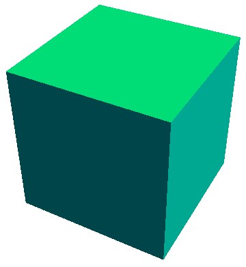

*carpet.cpp

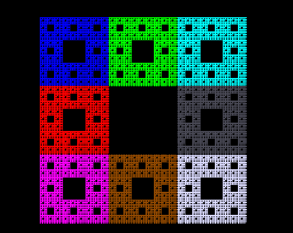

*Gasket.c

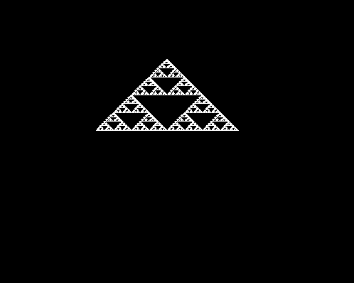

*Gasket-new.c

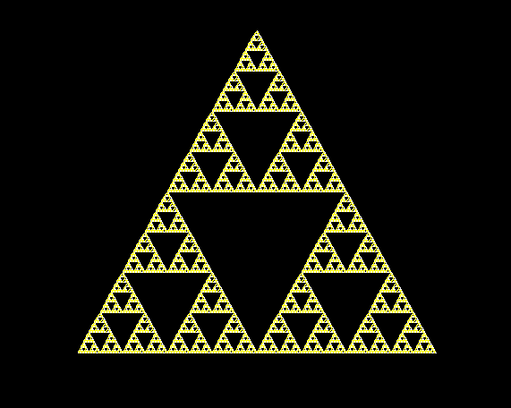

*Gasket_thr_point.c 

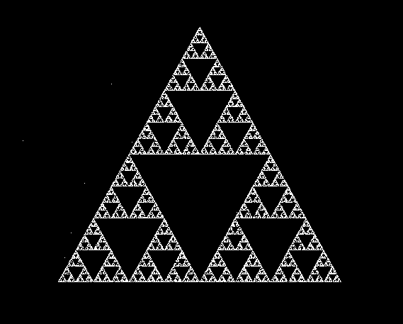

*Recursive Circle

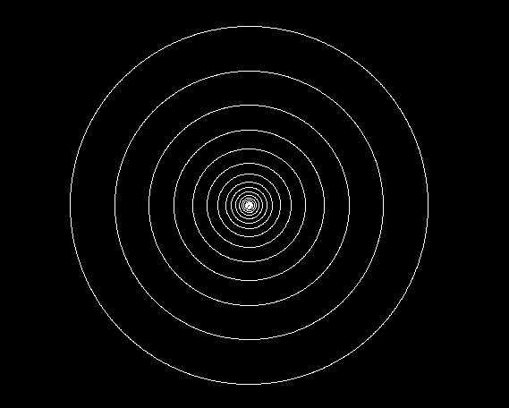

*roshetacode.cpp

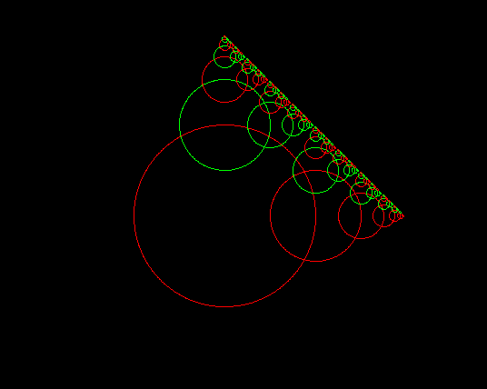

*test1.c

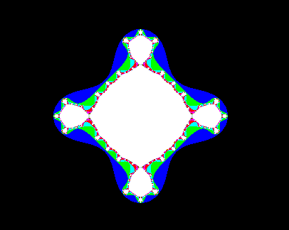

*Transformation.c

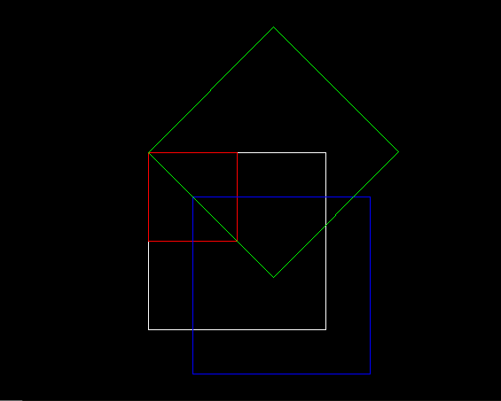

*Transformation_single.c

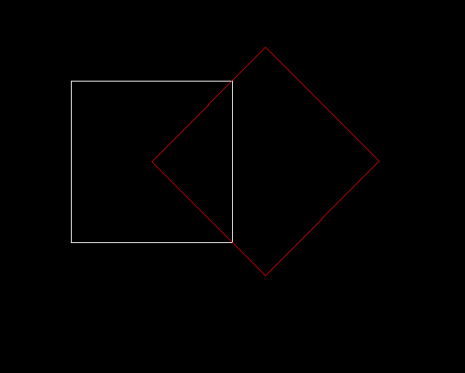

##Julia Set

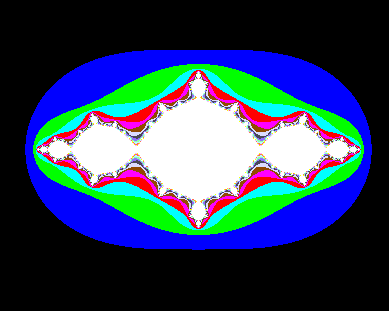

## Koch
*koch_quad

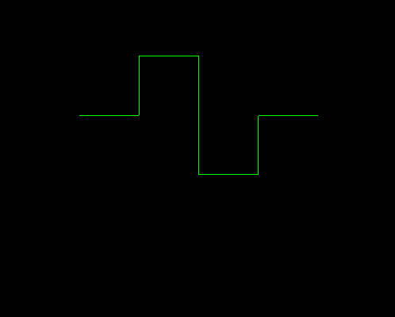

*koch_modified

## Mandelbort

*Mendalbort.cpp
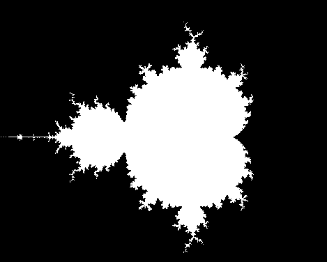

*mandelbort.c

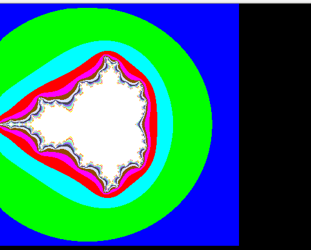
