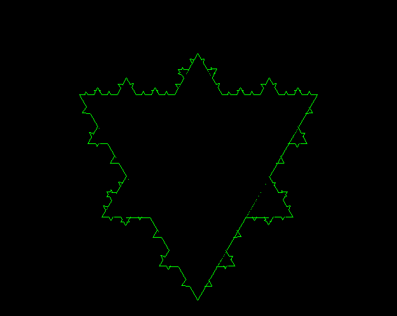

# Fractals

These program written during course work of MAI-215 Named Fractal Theory.
Most of these programs are completed. Some of them contain error.
I tried using C,C++,Java,Python to build fractals image.

Note:-

While executing c and c++ program use lgraph in last during compliation.
Ex. - gcc example.cpp -lgraph

Output- 

*Cantor Set(GRCANTOR.C)

*Cantor Cubes

*carpet.cpp

*Gasket.c

*Gasket-new.c

*Gasket_thr_point.c 

*Recursive Circle

*roshetacode.cpp

*test1.c

*Transformation.c

*Transformation_single.c

##Julia Set

## Koch
*koch_quad

*koch_modified

## Mandelbort

*Mendalbort.cpp

*mandelbort.c

